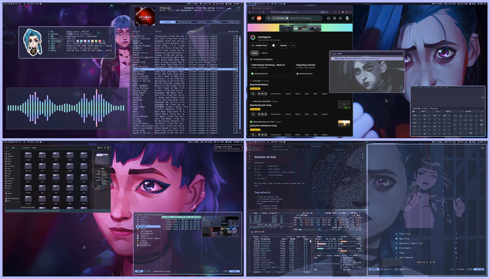
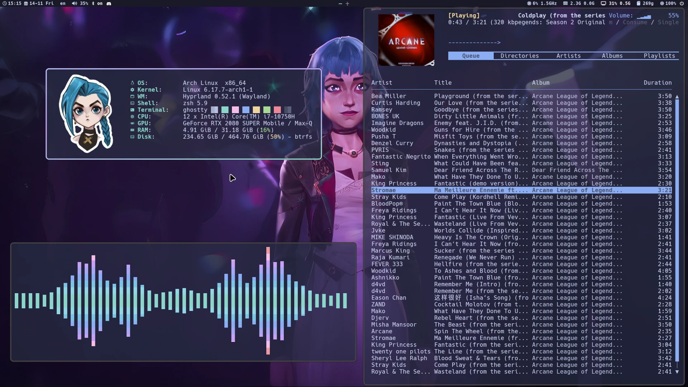
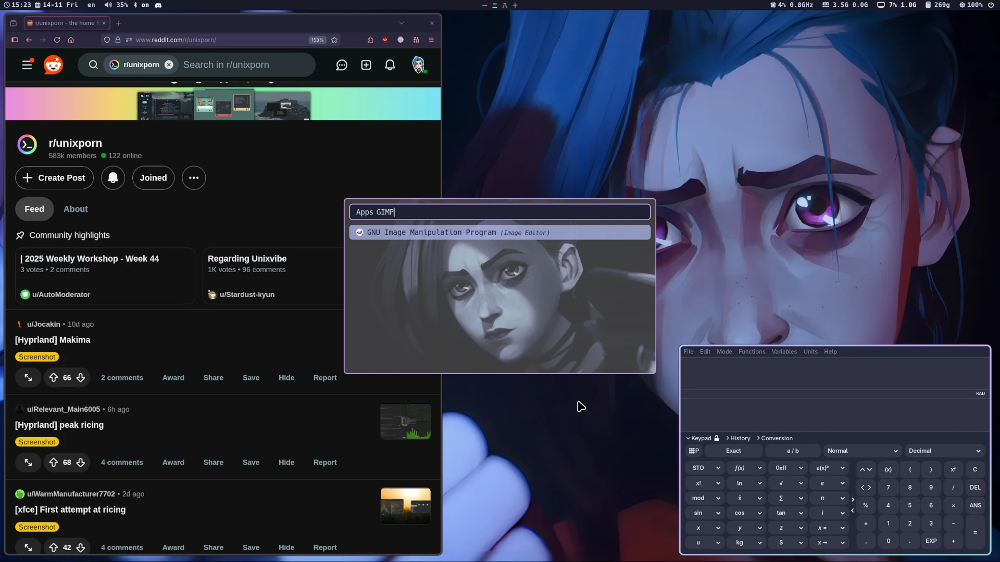
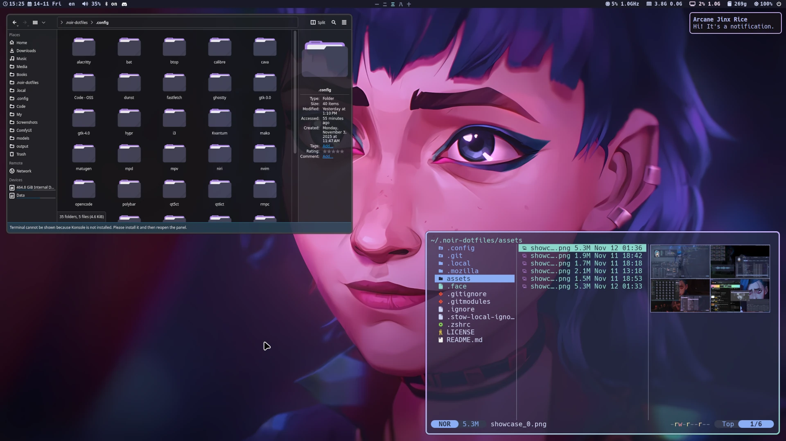
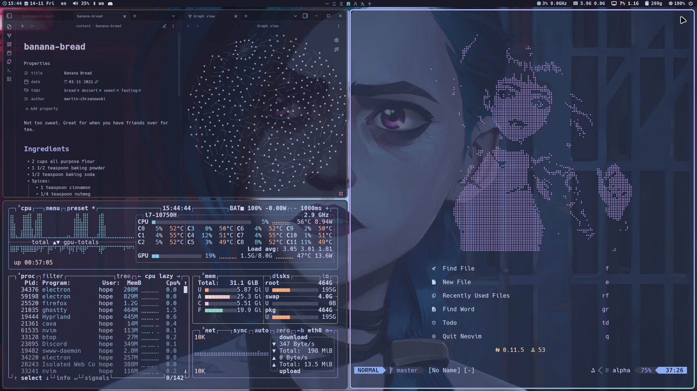
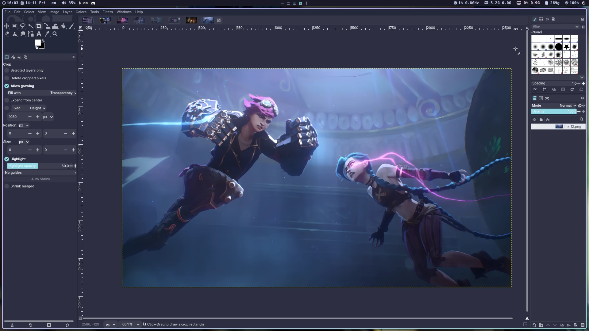

# About

  This repo is a cozy home for scripts and configurations (aka .dotfiles) on my Linux setup. All tools are open-source and freely available, allowing you to use, modify, and share them as you like.

# Showcase

  

  
More screenshots

  

    
    
    
    
    
    
  

# Featured Software

|                   |                                                                                                                              |                                                     |                                               |
| ----------------- | ---------------------------------------------------------------------------------------------------------------------------- | --------------------------------------------------- | --------------------------------------------- |
| WM                | [Hyprland](https://github.com/hyprwm/Hyprland)                                                                               | [Niri](https://github.com/YaLTeR/niri)              | [i3](https://github.com/i3/i3)                |
| Bar               | [Waybar](https://github.com/Alexays/Waybar)                                                                                  |                                                     | [Polybar](https://github.com/polybar/polybar) |
| File Manager      | [Yazi](https://github.com/sxyazi/yazi)                                                                                       | [Dolphin](https://github.com/KDE/dolphin)           | [Thunar](https://gitlab.xfce.org/xfce/thunar) |
| Music Player      | [RMPC](https://github.com/mierak/rmpc) + [MPD](https://github.com/MusicPlayerDaemon/MPD)                                     |                                                     |                                               |
| Editor            | [Neovim](https://github.com/neovim/neovim)                                                                                   | [VSCode](https://github.com/microsoft/vscode)       |                                               |
| Terminal          | [Ghostty](https://github.com/ghostty-org/ghostty)                                                                            | [Alacritty](https://github.com/alacritty/alacritty) |                                               |
| Shell             | Zsh +   [Zinit Plugin Manager](https://github.com/zdharma-continuum/zinit) +   [Starship Prompt](https://starship.rs/) |                                                     |                                               |
| Lockscreen        | hyprlock                                                                                                                     |                                                     |                                               |
| Wallpaper Manager | [SWWW](https://github.com/LGFae/swww)                                                                                        | [Feh](https://github.com/derf/feh)                  |                                               |
| Wallpapers        | [Link](https://github.com/somanoir/noir-wallpapers)                                                                          |                                                     |                                               |
| Font              | [Hack Nerd Font](https://github.com/ryanoasis/nerd-fonts?tab=readme-ov-file)                                                 |                                                     |                                               |
| App Theme         | [Catppuccin](https://github.com/catppuccin/catppuccin)                                                                       |                                                     |                                               |
| Cursor Theme      | [Bibata](https://github.com/ful1e5/Bibata_Cursor)                                                                            |                                                     |                                               |
| Icon Theme        | [Tela-circle](https://github.com/vinceliuice/Tela-circle-icon-theme)                                                         |                                                     |                                               |

# Installation

I've made automated scripts to install all necessary packages and pull the
dotfiles on your machine. Make sure to read the instructions in their
corresponding repositories.

- [Arch](https://github.com/somanoir/noir-archinstall)
- [Fedora](https://github.com/somanoir/noir-fedorainstall)

# Known Issues

> Qt themes seem to behave unpredictably outside KDE Plasma (inconsistent
> background color, broken buttons and menus, etc). Might be worth leaving them
> with default styles.

> On Fedora, packaged cava doesn't respect orientation = horizontal property.
> Building cava from source fixes the issue.
> (https://github.com/karlstav/cava?tab=readme-ov-file#from-source)

> On Fedora, initial launch of Steam requires the following env variable (launch
> from terminal): __GL_CONSTANT_FRAME_RATE_HINT=3 steam

# Feedback

- If you have any questions or suggestions regarding the project, feel free to
  join [Discussions](https://github.com/somanoir/.noir-dotfiles/discussions).
- Found a bug? Open an
  [Issue](https://github.com/somanoir/.noir-dotfiles/issues).

# Special thanks

I would like to express special thanks to the following people for their
tremendous work as well as direct and indirect contributions to this project:

- [mierak](https://github.com/mierak) for making a great TUI music player
  [rmpc](https://github.com/mierak/rmpc) and a multitude of helpful suggestions
  in setting up my config files for the player.
